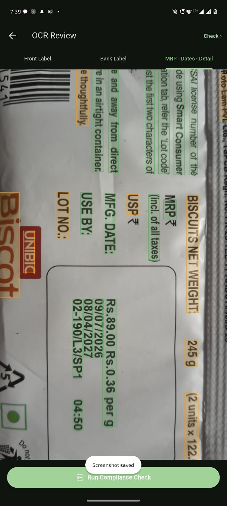
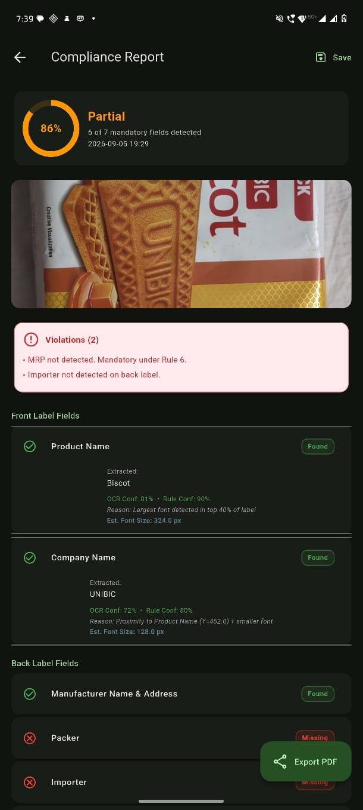
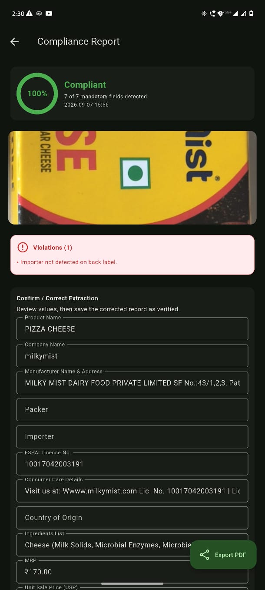

<p align="center">
  
</p>

<h1 align="center">MetriScan AI</h1>

<p align="center">
  <strong>Offline packaged-commodity label compliance checking for Legal Metrology.</strong>
</p>

<p align="center">
  <a href="https://github.com/Akshat-indev/MetriScan"></a>
  
  
</p>

MetriScan AI is a Flutter mobile application for **SIH 2026 Problem Statement 26034**. It turns a slow, manual packaged-label inspection into a guided scan-and-check workflow for declarations required by the **Legal Metrology (Packaged Commodities) Rules, 2011**.

The app captures the front, back, and detail areas of a package, runs on-device OCR, reconstructs the label layout, extracts legally relevant fields, and produces an explainable compliance report — without sending label images or OCR text to a cloud service.

## What it checks

- Product and company information
- MRP and unit sale price (USP)
- Net quantity and package count
- Manufacturer, packer, and importer declarations
- Manufacturing and expiry dates
- Lot or batch number
- FSSAI license number
- Consumer-care information
- Ingredients and country-of-origin details
- Approximate text readability / font-size warnings for human review

## Why MetriScan is different

The OCR model is an existing technology. MetriScan's contribution is the explainable processing layer built around it:

1. **Guided three-stage capture** — front label, back label, and detail/MRP/date capture reflect how information is actually distributed across packaging.
2. **Layout-aware extraction** — OCR text is grouped by visual lines, columns, proximity, and cross-photo relationships instead of being treated as a flat string.
3. **Dual-path text handling** — the architecture separates normal printed text from low-contrast dot-matrix/stamped fields such as batch and date codes.
4. **Strict field validation** — date fields are either valid parsed dates or null; ambiguous same-line values such as MRP and USP are resolved independently.
5. **Explainable confidence** — OCR confidence and field-match confidence are tracked separately.
6. **Correction memory** — verified corrections can be remembered for previously seen products and recurring OCR patterns without claiming that a trained model already exists.
7. **Training-data export** — verified scans can be packaged with source images, OCR overlays, extracted values, confidence metadata, and corrections for a future lightweight model.

## Architecture

```text
Camera / gallery
       │
       ▼
Guided capture: Front → Back → Detail
       │
       ▼
On-device OCR + image preprocessing
       │
       ├── Temporary correction-memory preprocessing
       ▼
Spatial organization: lines, columns, label/value proximity
       │
       ▼
Deterministic rule engine + cross-image matching
       │
       ├── Temporary product-memory override
       ▼
Compliance report
       │
       ├── Confirm / Correct → local verified record
       ├── Send to training set → JSONL append
       └── Export training data → images + OCR overlays + JSON/ZIP
```

The correction-memory layer lives in [`lib/correction_memory`](lib/correction_memory) with its own SQLite database and tables. It is intentionally isolated so it can later be replaced wholesale by a trained confidence-reranking model.

## Technology

- **Flutter / Dart**
- **Google ML Kit Text Recognition** for the current on-device OCR integration
- **SQLite** for local scan history and isolated correction memory
- **OpenCV Dart** and image processing for capture enhancement
- **Riverpod** for state management
- **GoRouter** for navigation
- **PDF and ZIP export** for reports and future training-data packaging

## Screenshots

### OCR review

<p align="center">
  
</p>

### Compliance report

<p align="center">
  
  
</p>

## Getting started

### Requirements

- Flutter SDK 3.x
- Dart SDK compatible with `pubspec.yaml`
- Android Studio / Android SDK for Android builds
- A physical device or emulator with camera support for live scanning

### Install and run

```bash
flutter pub get
flutter run
```

### Run tests

```bash
flutter test
```

### Build the Android APK

```bash
flutter build apk --debug
```

The generated APK is written to:

```text
build/app/outputs/flutter-apk/app-debug.apk
```

## Verified correction and future AI pipeline

MetriScan does **not** currently train a neural network. The current system is deliberately deterministic and debuggable:

- A user reviews the extracted fields.
- Corrections are saved as a verified record.
- The correction-memory layer can reuse high-confidence product and OCR-pattern corrections.
- The user can append verified records to a local JSONL training set.
- The export pipeline packages images, OCR-marked overlays, raw OCR blocks, extracted fields, confidence values, and `corrections_made`.

Once enough verified examples have been collected across real product categories, the planned next phase is a small offline model used as a **confidence reranker** over rule-engine candidates. The rule engine remains the transparent fallback.

## Current status

This is an active SIH prototype. The core scan, OCR, extraction, report, correction, and export flows are implemented, while accuracy is still being validated across a wider range of packaging:

- OCR bounding-box rendering and coordinate calibration continue to be refined.
- Font-size/readability is a conservative human-review estimate, not a certified legal measurement.
- Correction memory includes diagnostics for write/read paths, fingerprints, similarity, and overrides.
- Validation across 5–8 genuinely different product categories is still important before claiming a representative accuracy number.

These limitations are stated intentionally: the project prioritizes an honest, offline, explainable compliance workflow over unsupported claims of generalization or active model training.

## Project structure

```text
lib/
├── core/
│   ├── services/              OCR, spatial organization, rule engine, exports
│   ├── models/                Reports, fields, OCR blocks, scan stages
│   └── utils/
├── correction_memory/         Temporary isolated similarity-memory layer
├── features/
│   ├── capture/               Guided camera workflow
│   ├── ocr_review/            OCR blocks and overlays
│   ├── report/                Confirm/correct compliance report
│   └── training_export/       Verified-data export UI
└── shared/
    └── widgets/
```

## Roadmap

- Calibrate OCR overlays and text-size estimates against real label images.
- Expand dot-matrix and stamped-text preprocessing across more packaging types.
- Improve document-boundary capture and perspective handling.
- Accumulate verified examples through the export pipeline.
- Train and evaluate a lightweight offline candidate-reranking model.
- Add richer PDF reporting and audit-friendly explanations.
- Extend toward enforcement dashboards, role-based access, and e-commerce listing checks.

## Contributing

Issues, test fixtures, label examples, and reproducible OCR cases are especially useful. When adding extraction behavior, include a focused regression test and preserve the rule engine's explainability.

## License

This repository is an SIH project prototype. Add the project's final license and contribution policy before public production reuse.
